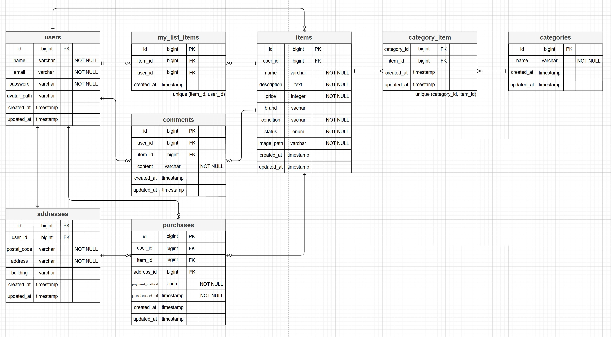
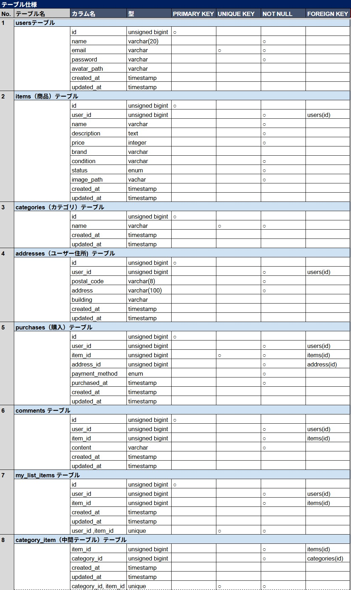

# coachtech-freemarket

# ◎ coachtechフリマ

本アプリは、coachtech が提示する仕様書をもとに作成したフリマアプリです。
ユーザー登録、ログイン、商品一覧、商品詳細、出品、購入、プロフィール編集など、
フリマアプリとして必要な基本機能を実装しています。

# ◎ 🐳 開発環境構築

## ◆ リポジトリのクローン

```bash
git clone git@github.com:nasu-masa/coachtech-freemarket.git
cd coachtech-freemarket
```

## ◆ Docker ビルド & 起動

```bash
docker-compose up -d --build
```

# ◆ storage ディレクトリの初期化と共有

ホスト側で実行：

```bash
mkdir -p src/storage/framework/sessions
mkdir -p src/storage/framework/views
mkdir -p src/storage/framework/cache
```

コンテナ内で権限を修正：

```bash
docker-compose exec php bash
```

```bash
chown -R www-data:www-data storage
chmod -R 775 storage

```

# ◆ storageディレクトリを初期化しホストと共有する理由

Laravel の storage は、キャッシュ・セッション・ビュー・アップロード画像など
アプリが書き込むファイルを保存する重要なディレクトリです。

Docker コンテナ内の storage は再起動で消えてしまうため、
ホスト側の storage をコンテナに共有（マウント）して使用します。

```bash
yaml
volumes:
  - ./src/storage:/var/www/storage
```

## ◆ Laravel セットアップ

```bash
docker-compose exec php bash
```

```bash
composer install
```

```bash
cp .env.example .env

php artisan key:generate

exit
```
```bash
code .        #.envファイルを必要に応じて環境変数変更）
```

## ◆ マイグレーション & シーディング
```bash
docker-compose exec php bash
```
```bash
php artisan migrate:fresh
php artisan db:seed
php artisan storage:link
```

※Seeder により、以下のテストユーザーが作成されます。

◎テストユーザー

```bash
メールアドレス: test@example.com
パスワード: test7890
```

◎他のユーザー

```bash
メールアドレス: other@example.com
パスワード: test7890
```

◎その他はfactoryにて生成したランダムユーザーです。

## 🔐 ログイン方法

アプリのログイン画面で、以下を入力してください。

メールアドレス :
```bash
test@example.com
```
パスワード :
```bash
test7890
```
## このユーザーに付与されているダミーデータ

### ◎ プロフィール関連
- 名前 (name)
- メールアドレス(email)
- パスワード(password)
- 住所(address, building)
- プロフィール画像（avatar_path）

### ◎ 商品データ
以下はテストユーザーが実際に行った操作として登録されています。

#### 出品した商品
- HDD（1件）

#### 購入した商品
- 腕時計（1件）

#### いいねした商品
- 腕時計（1件）

#### コメントした商品
- 腕時計（1件）


## ◆テスト環境のセットアップ

1. テスト用 `.env.testing` ファイルの作成とアプリキーの生成

```bash
cp .env .env.testing  # 必要に応じて環境変数を変更
```

## .env.testing の変更ポイント

```bash
APP_ENV=testing
APP_DEBUG=true
DB_CONNECTION=mysql
DB_DATABASE=demo_test   ← テスト用DB名
DB_USERNAME=laravel_user
DB_PASSWORD=laravel_pass
```

## .env からコピーしたAPP_KEYを削除し .env.testing用に作り直します

```bash
php artisan key:generate --env=testing
```
```bash
exit;
```

DB 接続情報（DB_HOST / DB_DATABASE / DB_USERNAME / DB_PASSWORD）は、各自のローカル環境に合わせて変更してください。

2. テスト用データベースの作成（重要）
   Laravel のテストは .env.testing の設定を使用します。
   .env.testing に記載されている DB 名（例：demo_test）のデータベースを 事前に作成する必要があります。


```bash
docker exec -it <mysqlコンテナ名> bash
```
```bash
mysql -u root -p
```
```bash
CREATE DATABASE demo_test;
SHOW DATABASES;
```
```bash
exit;
```
```bash
exit;
```

※ <mysqlコンテナ名> は docker ps で確認できます。

3. テスト用マイグレーションの実行
   テスト DB を作成したら、テーブルを作成します。

```bash
docker compose exec php bash
php artisan migrate:fresh --env=testing
```

もし権限エラーが出た場合：

```bash
docker compose exec mysql bash
mysql -u root -p
```

権限を付与する：

```bash
GRANT ALL PRIVILEGES ON demo_test.* TO 'laravel_user'@'%';
FLUSH PRIVILEGES;
exit;
```

```bash
exit;
docker compose exec php bash
```

再度migrate:freshを実行してください。

```bash
php artisan migrate:fresh --env=testing
```

4. テストの実行

```bash
php artisan test --env=testing
```

DB 接続情報などは 各自のローカル環境に合わせて変更してください。
Stripe / AWS / Pusher などの秘密情報は 空欄のままで OK。

## ◆Stripe のセットアップ

※本アプリでは、商品購入時の決済に **Stripe** を使用しています。

### ◆ インストール

```bash
composer require stripe/stripe-php
```

---

### ◆ Stripe の環境変数（.env）

# Stripe

STRIPE_KEY=pk_test_1234567890abcdef
STRIPE_SECRET=sk_test_1234567890abcdef

※ 本アプリでは Stripe の「テスト用のkey（pk_test / sk_test）」を使用しているため各々のテスト用test-keyをご使用ください。
Feature テストでは StripeService をモック(代用品を使用)しているため、Stripe API は実際には呼ばれません。

## ◆ 開発環境 URL

| 機能                 | URL                       |
| -------------------- | ------------------------- |
| トップページ          | http://localhost/         |
| ユーザー登録          | http://localhost/register |
| phpMyAdmin           | http://localhost:8080/    |
| MailHog（メール確認） | http://localhost:8025/    |

# ◎ テーブル仕様書 & ER図

本アプリケーションは、仕様書（US001〜US009）に基づき
データベース設計を行っています。

以下に **ER図** と **テーブル仕様書** を掲載します。

---

## ◆ ER図（Entity Relationship Diagram）



ER図では以下のエンティティを定義しています：

- users
- items
- categories
- category_item（中間テーブル）
- comments
- addresses
- purchases
- my_list_items

---

## ◆ テーブル仕様書



テーブル仕様書では以下の内容を定義しています：

- カラム名
- データ型
- 主キー
- ユニークキー
- NULL 許可
- 外部キー制約

本アプリのマイグレーションファイルは、

このテーブル仕様書と完全に一致するように実装しています。

---

# ◎ 使用技術（実行環境）

- **PHP 8.x**
- **Laravel 8**
- **MySQL 8.0.32**
- **nginx 1.21.1**
- **Docker / Docker Compose**
- **CSS**
- **Laravel Fortify（認証）**

> ※ 各サービスの構成は `docker-compose.yml` を参照してください

## ◆ 主なルーティング一覧（web.php） ※抜粋

| 画面             | メソッド | パス                 | コントローラー              |
| --------------- | -------- | ------------------- | -------------------------- |
| 商品一覧         | GET      | /                   | ItemController@index       |
| 商品詳細         | GET      | /item/{id}          | ItemController@show        |
| 出品フォーム     | GET      | /sell               | ItemController@create      |
| 出品処理         | POST     | /sell               | ItemController@store       |
| コメント投稿     | POST     | /item/{id}/comments | CommentController@store    |
| いいね追加       | POST     | /item/{id}/like     | MyListItemController@store |
| 購入確認         | GET      | /purchase/{id}      | PurchaseController@create  |
| 購入処理         | POST     | /purchase/{id}      | PurchaseController@store   |
| マイページ       | GET      | /mypage             | ProfileController@index    |
| プロフィール編集  | GET      | /mypage/profile     | ProfileController@edit     |

## ◆ コントローラー 一覧（Controller）

| コントローラーファイル名 | 説明                                                         |
| ------------------------ | --------------------------------------------------------- |
| ItemController.php       | 商品一覧・詳細・出品フォーム・出品処理を担当                  |
| MyListItemController.php | マイリスト（お気に入り）追加を担当                           |
| CommentController.php    | 商品へのコメント投稿を担当                                   |
| PurchaseController.php   | 購入確認画面・購入処理を担当                                 |
| AddressController.php    | 購入時の住所変更画面・住所更新処理を担当                      |
| ProfileController.php    | マイページ、購入履歴・出品履歴、プロフィール編集・更新を担当    |
| RegisterController.php   | 会員登録フォームの表示と、登録処理を担当                      |
| LoginController.php      | ログインフォームの表示と、ログイン処理を担当                  |

## ◆ モデル 一覧（Model）

| モデルファイル名 | 説明                                                                                 |
| ---------------- | -----------------------------------------------------------------------------------|
| User.php         | ユーザー情報を管理                                                                   |
| Address.php      | ユーザーの住所情報（郵便番号・都道府県・市区町村・番地・建物名）を管理                    |
| Category.php     | 商品カテゴリを管理                                                                   |
| Comment.php      | 商品へのコメントを管理                                                               |
| Item.php         | 出品された商品データ（画像・タイトル・説明・価格・カテゴリ・ブランド・状態・出品者）を管理 |
| MyListItem.php   | ユーザーのお気に入り（マイリスト）を管理                                               |
| Purchase.php     | 購入情報（購入者・商品・購入日時・金額）を管理                                         |

## ◆ ビュー 一覧（Bladeファイル）

| 画面名称                         | Bladeファイル名                 |
| -------------------------------  | ----------------------------- |
| 商品一覧画面（トップ画面）         | items/index.blade.php          |
| 会員登録画面                     | auth/register.blade.php         |
| ログイン画面                     | auth/login.blade.php            |
| 商品詳細画面                     | items/show.blade.php            |
| 商品購入画面                     | purchase/create.blade.php       |
| 配送先住所変更画面               | purchase/address_edit.blade.php |
| 商品出品画面                     | items/create.blade.php          |
| プロフィール画面                 | mypage/index.blade.php          |
| プロフィール編集画面（設定画面）  | mypage/profile_edit.blade.php   |
| メール認証誘導画面               | auth/verify_email.blade.php     |

## ◆ フロントエンド構成（CSS / JS）

CSS・JavaScript はページ単位と共通コンポーネントに分割されています。
詳細は `public/css/` および `public/js/` ディレクトリを参照してください。

# ◎ 主な機能一覧（仕様書 US001〜US009 に準拠）

## ◆ 認証（US001〜US003）

- 会員登録（メール認証あり）
- ログイン / ログアウト
- 初回プロフィール設定
- 認証メール再送
- 未認証ユーザーのアクセス制御

## ◆ 商品一覧（US004）

- 全商品の一覧表示
- 購入済み商品の「Sold」表示
- 自分の出品商品を非表示
- いいね一覧（マイリスト）
- 商品名の部分一致検索

## ◆ 商品詳細（US005）

- 商品情報の表示（画像・名前・ブランド・価格・カテゴリ・状態）
- コメント一覧表示
- コメント投稿（バリデーションあり）
- いいね登録 / 解除

## ◆ 商品購入（US006）

- 購入前情報の表示（商品・価格・住所）
- 支払い方法選択（コンビニ / カード）
- Stripe 決済画面への遷移
- 購入後の「Sold」反映
- 配送先住所の変更

## ◆ プロフィール（US007〜US008）

- プロフィール表示（画像・名前・出品一覧・購入一覧）
- プロフィール編集（画像・住所・ユーザー名）

## ◆ 商品出品（US009）

- 商品情報の登録（カテゴリ複数選択・状態・名前・ブランド・説明・価格）
- 商品画像アップロード（storage 保存）

# ◎ 💳 決済サービス（Stripe）

本アプリでは、商品購入時の決済に **Stripe** を使用しています。

## ◆ 決済フロー

- 商品詳細ページから「購入する」をクリック
- Stripe Checkout にリダイレクト
- 決済完了後、トップページへ遷移

# ◎ ライセンス

このプロジェクトは学習目的で作成されています。
